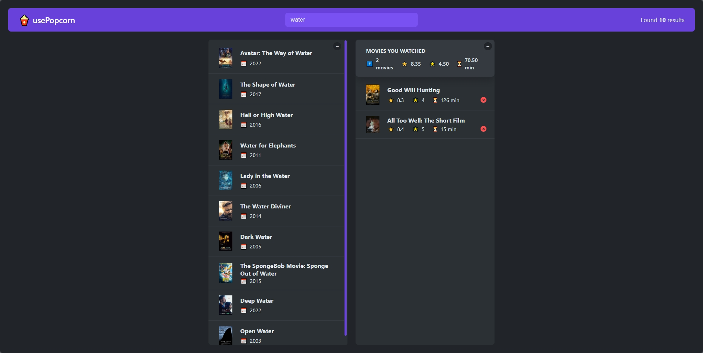
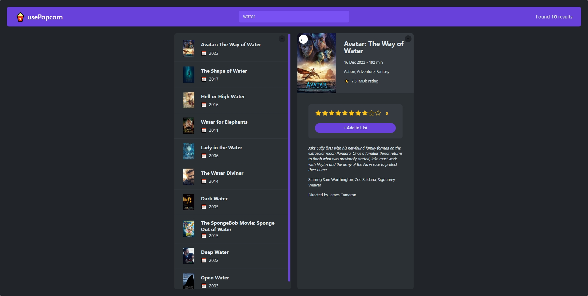
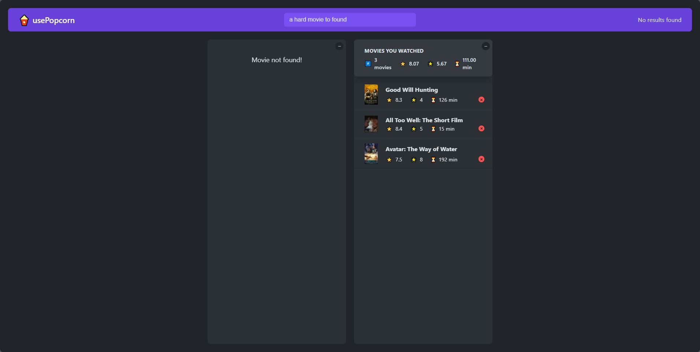

# usePopcorn

usePopcorn is a React-based web application that allows users to search for movies, view movie details, and manage a list of watched movies. The application fetches movie data from the [OMDB API](https://www.omdbapi.com/) and provides a user-friendly interface for interacting with the movie database.


## Features

- **Search Movies**: Users can search for movies by title.
- **View Movie Details**: Users can view detailed information about a selected movie, including the title, year, poster, runtime, IMDb rating, plot, actors, director, and genre.
- **Manage Watched Movies**: Users can add movies to a watched list, rate them, and view a summary of watched movies.
- **Star Rating**: Users can rate watched movies using a star rating system.
- **Local Storage**: Watched movies and ratings are stored in local storage and persist between sessions.
- **Keyboard Shortcuts**: Users can navigate the application using keyboard shortcuts. For example, pressing the `Enter` key will focus the search bar, and pressing the `Escape` key will close the selected movie.
- **Loading Indicator**: A loading indicator is displayed while fetching movie data.
- **Error Handling**: Error messages are displayed when there is an issue fetching movie data.
- **Responsive Design**: The application is designed to be responsive and works well on both desktop and mobile devices.

## Technologies Used

- **React**: A JavaScript library for building user interfaces.
- **React Hooks**: Used for managing state and side effects.
- **CSS**: For styling the application.
- **OMDB API**: Used to fetch movie data.

## Project Structure

```
usepopcorn/
├── docs/
│   └── index.html
├── screenshots/
│   ├── screenshot1.png
│   ├── screenshot2.png
│   └── screenshot3.png
├── src/
│   ├── components/
│   │   ├── Box.js
│   │   ├── ErrorMessage.js
│   │   ├── Loader.js
│   │   ├── Logo.js
│   │   ├── Main.js
│   │   ├── Movie.js
│   │   ├── MovieDetails.js
│   │   ├── MovieList.js
│   │   ├── NavBar.js
│   │   ├── NumResults.js
│   │   ├── Search.js
│   │   ├── StarRating.js
│   │   ├── WatchedMovie.js
│   │   ├── WatchedMoviesList.js
│   │   └── WatchedSummary.js
│   ├── hooks/
│   │   ├── useKey.js
│   │   ├── useLocalStorageState.js
│   │   ├── useMovieSelection.js
│   │   └── useMovies.js
│   ├── utils/
│   │   └── average.js
│   ├── styles/
│   │   └── index.css
│   ├── constants/
│   │   └── keys.js
│   ├── App.js
│   └── index.js
├── .gitignore
├── package.json
└── README.md
```

## Installation

1. Clone the repository:
   ```sh
   git clone https://github.com/tarek0m/usepopcorn.git
   cd usepopcorn
   ```
2. Install the dependencies:

   ```sh
   npm install
   ```

3. Start the development server:

   ```sh
   npm start
   ```

## Usage

- Open your browser and navigate to `http://localhost:3000`.
- Use the search bar to find movies by title.
- Click on a movie to view its details.
- Add movies to your watched list and rate them.

## Screenshots




## Live Demo

A live demo of the application can be found [here](https://tarek0m.github.io/usepopcorn).
